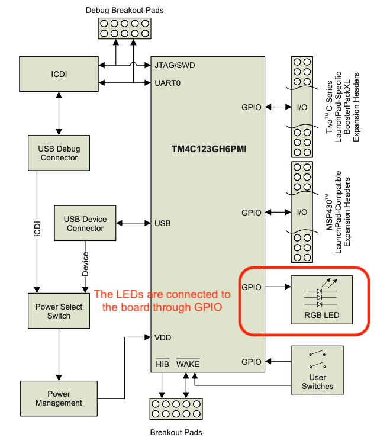

# Lesson 4: Blink the LED

In the lesson 4, we are going to learn how to read the documents of Tiva board and TM4C123GH6PM Microcontroller. 

According to the block diagram of the Tiva's evaluation board, the LED red, green and blue are controlled by as the below figure shows:

## Reference
1. [Embedded Systems Programming Lesson 4 Blinking the LED by Miro Samek](https://www.youtube.com/watch?v=D0VuYe77Wu0&list=PLfcIZXsDLA1-QEyrD4R9YcWWKpbCcrGVP&index=5)
2. [Data sheet of TM4C123GH6PM Microcontroller](https://www.ti.com/lit/ds/symlink/tm4c123gh6pm.pdf?ts=1629421963999&ref_url=https%253A%252F%252Fwww.google.com%252F)
3. [Manual of Tiva C Series TM4C123G LaunchPad Evaluation Board](https://www.ti.com/lit/ug/spmu296/spmu296.pdf?ts=1629375237888&ref_url=https%253A%252F%252Fwww.google.com%252F)